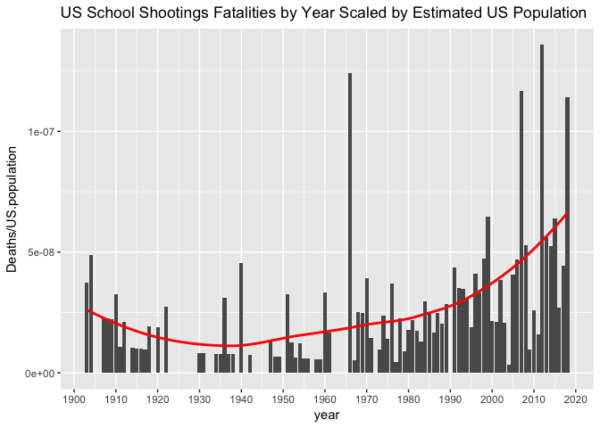

US School Shootings by Year
================
John Mount

This is not a fully vetted analysis. I copied data from Wikipedia (sources given below) and took a quick look. Also it would be good to normalize by the US school population (or at least US school age population) instead of the total US population. But the observed ratio (current rate about 4 times the 1950s through 1960s typical rate) is large enough that it is plausible the rate is with investigating further (i.e. it is probably not entirely due to un-modeled changes in population age or school attendance rates).

Follow-ups would include confirming input data, confirming data conversion, and taking a closer look at the estimated population model.

``` r
library(dplyr)
```

    ## 
    ## Attaching package: 'dplyr'

    ## The following objects are masked from 'package:stats':
    ## 
    ##     filter, lag

    ## The following objects are masked from 'package:base':
    ## 
    ##     intersect, setdiff, setequal, union

``` r
library(lubridate)
```

    ## 
    ## Attaching package: 'lubridate'

    ## The following object is masked from 'package:base':
    ## 
    ##     date

``` r
library(ggplot2)
library(forecast)
# https://en.wikipedia.org/wiki/List_of_school_shootings_in_the_United_States
school_shootings <- read.csv("SchoolShootings.csv", stringsAsFactors = FALSE)
school_shootings <- school_shootings %>%
  mutate(dt = mdy(Date)) %>%
  mutate(year = year(dt)) 

# check we parsed correctly
head(school_shootings)
```

    ##                Date                  Location Deaths Injuries
    ## 1     July 26, 1764 Greencastle, Pennsylvania     10        2
    ## 2 November 12, 1840 Charlottesville, Virginia      1        0
    ## 3  November 2, 1853      Louisville, Kentucky      0        1
    ## 4   August 16, 1856         Florence, Alabama      2        0
    ## 5      July 8, 1858       Baltimore, Maryland      1        0
    ## 6  January 21, 1860     Todd County, Kentucky      1        0
    ##                                                                                                                                                                                                                                                                                                                                                                                                                                                                                                                                                                                                                                       Description
    ## 1 Enoch Brown school massacre: Perhaps the earliest shooting to happen on school or college property, in what would become the\xcaUnited States, was the notorious Enoch Brown school massacre during the\xcaPontiac's War. Four Delaware (Lenape) American Indians entered the schoolhouse near present-day\xcaGreencastle, Pennsylvania, and shot and killed schoolmaster Enoch Brown and nine children (reports vary). Only two children survived. However, this incident may only incidentally be considered a school "shooting" because only the teacher was shot, while the other nine victims were killed with\xcamelee weapons.\xca[1][2]
    ## 2                                                                                                                                                                                                                                                                                                                                                                                                                                                                                John Anthony Gardner Davis, a law professor at the\xcaUniversity of Virginia, was shot by student Joseph Semmes, and died from his wound three days later.[3][4]
    ## 3                                                                                                                                                                                                                                                                                                                                                                                                                        Student Mathews Flounoy Ward took a pistol to school, where he shot the schoolmaster William H.G. Butler as revenge for what Ward thought was excessive punishment of his brother the day before. Ward was acquitted.[5]
    ## 4                                                                                                                                                                                                                                                                               The schoolmaster had a tame sparrow and had warned the students not to harm it, threatening death. One of the boys stepped on the bird and killed it; he was afraid to return to school but did so. After lessons, the master took the boy into a private room and strangled him to death. The boy's father went to the school and shot the schoolmaster dead.[6]
    ## 5                                                                                                                                                                                                                                                                                                                                                                                                                                           The 15-year-old son of Col. John T. Farlow (Baltimore's Marshal of Police 1867\xd070), was killed during a\xcaSabbath School\xcagathering. The perpetrator escaped, but several arrests were made.[7]
    ## 6                                                                                                                                                                                                                                                                                                                                                                                                         A son of Col. Elijah Sebree was killed by another student. Young Sebree was threatening the other boy and said he intended to kill him. The other student got a gun and walked up to Sebree in the schoolhouse, where he killed him.[8]
    ##           dt year
    ## 1 1764-07-26 1764
    ## 2 1840-11-12 1840
    ## 3 1853-11-02 1853
    ## 4 1856-08-16 1856
    ## 5 1858-07-08 1858
    ## 6 1860-01-21 1860

``` r
school_shootings[is.na(school_shootings$dt), , drop = FALSE]
```

    ##     Date Location Deaths Injuries
    ## 271                   NA         
    ## 275                   NA         
    ## 291                   NA         
    ## 495                   NA         
    ##                                                                                                                                                                                                   Description
    ## 271                                                                                                                                                                                                     [315]
    ## 275                                                               9-year-old Dedrick Owens fatally shot 6-year-old classmate Kayla Rolland. Owens has since been the youngest documented school shooter.[318]
    ## 291 He killed two monks and seriously wounded another two before fatally shooting himself. Two weapons, a Chinese-made replica of the AK-47 and a sawed-off .22-caliber rifle, were found near the body.[334]
    ## 495                                                                                                                                                                                                     [573]
    ##       dt year
    ## 271 <NA>   NA
    ## 275 <NA>   NA
    ## 291 <NA>   NA
    ## 495 <NA>   NA

``` r
tail(school_shootings)
```

    ##               Date             Location Deaths Injuries
    ## 495                                         NA         
    ## 496 April 20, 2018       Ocala, Florida      0        1
    ## 497   May 11, 2018 Palmdale, California      0        1
    ## 498   May 16, 2018      Dixon, Illinois      0        1
    ## 499   May 18, 2018      Santa Fe, Texas     10       10
    ## 500   May 18, 2018   Jonesboro, Georgia      1        1
    ##                                                                                                                                                                                                                                          Description
    ## 495                                                                                                                                                                                                                                            [573]
    ## 496                                                                                                         Forest High School: Students were evacuated after a shooting occurred shortly before a national school walkout for gun control measures.
    ## 497                    Highland High School: 14-year-old former student fired a semiautomatic rifle shortly before classes were to begin. A 15-year-old was struck in the shoulder but went into surgery and was expected to recover fully.\xca[574]
    ## 498                                           Dixon High School: Student recently kicked off football team fires shots prior to graduation rehearsal. School resource officer shot suspect. Suspect had non-life threatening injuries.\xca[575][576]
    ## 499 Santa Fe High School shooting: School was evacuated when fire alarms pulled at 7:45 am after students said they had heard gunshots. Shooter had a shotgun and .38 revolver. Multiple IEDs and pipe bombs were also found around the school.[577]
    ## 500       Mount Zion High School: An argument led to a shooting in a parking lot after a high school graduation ceremony for graduates of Perry Learning Center. Mount Zion High School provided overflow parking for people attending the ceremony.
    ##             dt year
    ## 495       <NA>   NA
    ## 496 2018-04-20 2018
    ## 497 2018-05-11 2018
    ## 498 2018-05-16 2018
    ## 499 2018-05-18 2018
    ## 500 2018-05-18 2018

``` r
school_shootings <- school_shootings %>%
  filter(year>=1900)

# confirm data is clean (another parse check)
odd <- c(which(school_shootings$dt[-1] < school_shootings$dt[-nrow(school_shootings)]),
         which(is.na(as.numeric(school_shootings$Injuries))),
         which(is.na(school_shootings$Deaths)),
         which(is.na(school_shootings$Date)))
```

    ## Warning in which(is.na(as.numeric(school_shootings$Injuries))): NAs
    ## introduced by coercion

``` r
odd <- sort(unique(odd))
print(odd)
```

    ## [1]  18  26 179 244

``` r
idxs <- sort(unique(pmin(nrow(school_shootings),pmax(1,c(odd, odd+1, odd-1)))))
school_shootings[idxs, c("Date", "dt", "Deaths", "Injuries", "Location"), drop=FALSE]
```

    ##                   Date         dt Deaths Injuries                 Location
    ## 17      March 10, 1910 1910-03-10      0        0         Ione, California
    ## 18     August 16, 1910 1910-08-16      1        ?      Lexington, Kentucky
    ## 19      April 27, 1911 1911-04-27      1        0        Manhattan, Kansas
    ## 25  September 20, 1916 1916-09-20      0        1       Bemidji, Minnesota
    ## 26   December 26, 1916 1916-12-26      1        ?       Danville, Kentucky
    ## 27        June 5, 1917 1917-06-05      0        1 Harrisburg, Pennsylvania
    ## 178   January 29, 1992 1992-01-29      0        1               Kent, Ohio
    ## 179     April 23, 1992 1992-04-23      3        0     Bloomington, Indiana
    ## 180  February 26, 1992 1992-02-26      2        0       Brooklyn, New York
    ## 243      April 2, 2001 2001-04-02      1        0            Spring, Texas
    ## 244       May 16, 2001 2001-05-16      2        0     Parkland, Washington
    ## 245     March 22, 2001 2001-03-22      0        5     El Cajon, California

``` r
# clean up a bit
school_shootings$Injuries <- as.numeric(school_shootings$Injuries)
```

    ## Warning: NAs introduced by coercion

``` r
school_shootings <- school_shootings %>%
  filter((!is.na(Deaths)) & (!is.na(Date)))

# arrange dates
school_shootings <- school_shootings %>%
  arrange(dt)

yearly <- school_shootings %>%
  mutate(dt = mdy(Date)) %>%
  mutate(year = year(dt)) %>%
  group_by(year) %>%
  summarize(count = n(), 
            Deaths = sum(Deaths), 
            Injuries = sum(Injuries)) 

ggplot(yearly, aes(x = year, y = Deaths)) + 
  geom_col() + 
  geom_smooth(se = FALSE) +
  ggtitle("US School Shooting Fatalities by Year",
          subtitle = "https://en.wikipedia.org/wiki/List_of_school_shootings_in_the_United_States")
```

    ## `geom_smooth()` using method = 'loess'


``` r
# get per-year popluation estimates
# read per-decade counts
us_population <- read.csv("USpopulation.csv", stringsAsFactors = FALSE)
# confirm counts by 10s in order
assertthat::assert_that(
  all(us_population$year == 
        seq(from = min(us_population$year), by = 10, length.out = nrow(us_population))))
```

    ## [1] TRUE

``` r
us_population <- us_population %>%
  filter(year>=1900) %>% 
  arrange(year) 
# build an ARIMA model of the log-population time series
us_pop_model <- auto.arima(log(us_population$US.population))
print(us_pop_model)
```

    ## Series: log(us_population$US.population) 
    ## ARIMA(0,1,0) with drift 
    ## 
    ## Coefficients:
    ##        drift
    ##       0.1272
    ## s.e.  0.0102
    ## 
    ## sigma^2 estimated as 0.001286:  log likelihood=21.66
    ## AIC=-39.33   AICc=-37.83   BIC=-38.53

``` r
# ad future population estimate to table
us_pop_est <- exp(as.data.frame(forecast(us_pop_model, h=1))[["Point Forecast"]][[1]])
us_population <- rbind(us_population, 
                       data.frame(year = max(us_population$year) + 10,
                                  US.population = us_pop_est))
# confirm us_population spans region of interest.
assertthat::assert_that(min(us_population$year) <= min(yearly$year))
```

    ## [1] TRUE

``` r
assertthat::assert_that(max(us_population$year) >= max(yearly$year))
```

    ## [1] TRUE

``` r
# interpolate all needed years (linear on log scale, so geometric estimate)
est <- approx(us_population$year, log(us_population$US.population), yearly$year,
              method = "linear")
yearly$US.population <- exp(est$y)

# plot the ratio
ggplot(yearly, aes(x = year, y = Deaths/US.population)) + 
  geom_col() + 
  geom_smooth(se = FALSE, color = "red") +
  ggtitle("US School Shootings Fatalities by Year Scaled by estimated US Population")
```

    ## `geom_smooth()` using method = 'loess'


``` r
# re-plot normalized a typical non-zero rate in the 1950s and 1960s.
# only looking at non-zero years (inflates the base-rate, but data is wild so 
# lots of issues on what to use as the base rate).
base_rate_f <- yearly %>%
  filter((year>=1950) & (year<=1969)) %>%
  summarize(count = sum(count), 
            Deaths = mean(Deaths), 
            US.population = mean(US.population),
            rate = mean(Deaths/US.population),
            n = n())
base_rate <- base_rate_f$rate

ggplot(yearly, aes(x = year, y = (Deaths/US.population)/base_rate)) + 
  geom_col() + 
  geom_smooth(se = FALSE, color = "red") +
  geom_hline(yintercept = 1, alpha= 0.5) +
  ylab("relative rate") +
  ggtitle("US School Shootings Fatality Rate per US Population",
          subtitle = "scaled relative to 1950s through 1960s rate")
```

    ## `geom_smooth()` using method = 'loess'



In this analysis we are being conservative in using an inflated comparison rate (to try to not over-emphasize increase). The inflation is due to including only years in the 1950s and 1960s that had a shooting event and also there is a large event in the interval even though large events were rare in that time-frame (so we have not chosen an interval that avoids such).
